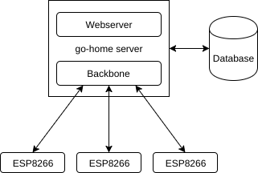

# go-home

go-home (pun intended) is my personal home automation system. It communicates with custom modules made with ESP8266s to activate relays and transmit temperature, light, movement, and all the data I might need to remotely control my home.

Commands are given through a web interface and transmitted through what I call the "backbone" which is a glorified UDP server.

## Structure

## Command system

| ID Byte | Description | From | To | Response | Example |
|---|---|---|---|---|---|
| D | Device discovery | Server | Device | D[UUID] | D:2d1044ca-6fd1-414a-a2c2-28d69d58d7c9 |
| G | Get information from device | Server | Device | G:[UUID]:[TEMP]:[LIGHT]:[MOVEMENT]:[RELAY]:[AIR] | G:2d1044ca-6fd1-414a-a2c2-28d69d58d7c9:21:85:0:0:-1 |
| S | Set relay state on device | Server | Device | S:[0/1] | S:1 (ON) |
